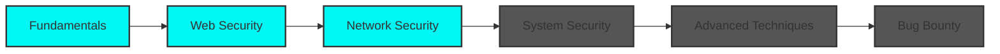

<div align="center">
  
</div>

<div align="center">
  
  [](https://git.io/typing-svg)
  
</div>

<br/>


### 👨‍💻 About Me

```python
class CyberSecurityStudent:
    def __init__(self):
        self.name = "Subhajit Nandi"
        self.role = "Cybersecurity Student"
        self.location = "India"
        self.interests = [
            "Penetration Testing",
            "Web Application Security",
            "Network Security",
            "Digital Forensics",
            "Threat Hunting"
        ]
        self.currently_learning = [
            "OWASP Top 10",
            "Binary Exploitation",
            "Malware Analysis",
            "Cloud Security"
        ]
    
    def say_hi(self):
        print("Thanks for visiting!")

me = CyberSecurityStudent()
me.say_hi()
```

<br clear="right"/>

---

### 🛡️ Cybersecurity Arsenal

<div align="center">

#### 🔍 Penetration Testing & Tools


#### 💻 Programming & Scripting


#### 🖥️ Operating Systems


</div>

---

### 🎯 Practice Platforms & Achievements

<div align="center">

<table>
<tr>
<td align="center" width="50%">

#### 🚩 TryHackMe

<a href="https://tryhackme.com/p/Subhajit1">
  
</a>

[](https://tryhackme.com/p/Subhajit1)

</td>
<td align="center" width="50%">

#### 🎖️ Focus Areas

🔐 **Web Exploitation**  
🌐 **Network Reconnaissance**  
🛠️ **Privilege Escalation**  
🔍 **OSINT Techniques**  
🧩 **Cryptography Challenges**

</td>
</tr>
</table>

</div>

---


### 🏆 Achievements & Certifications

<div align="center">

```ascii
╔═══════════════════════════════════════════════════════╗
║  🎓 Currently Pursuing Certifications:               ║
║                                                       ║
║  [ ] CompTIA Security+                               ║
║  [ ] Certified Ethical Hacker (CEH)                  ║
║  [ ] eJPT (Junior Penetration Tester)                ║
║  [ ] OSCP (Offensive Security Certified Professional)║
╚═══════════════════════════════════════════════════════╝
```

</div>

---

### 💡 Current Learning Path

<div align="center">



</div>

---

### 📫 Connect With Me

<div align="center">

[](https://www.facebook.com/subhajitnandi64/)
[](YOUR_LINKEDIN_URL)
[](YOUR_TWITTER_URL)
[](mailto:YOUR_EMAIL)
[](YOUR_DISCORD)

</div>

---

### 🌟 Featured Projects

<div align="center">

<a href="https://github.com/subhajit-sudo/Bug-Bounty-Automation-Toolkit-Installer">
  
</a>

<a href="https://github.com/subhojit64/rgb.bar">
  
</a>

</div>

---

### 📝 Latest Blog Posts

<!-- BLOG-POST-LIST:START -->
- Coming Soon: Write-ups on CTF challenges
- Security tips and tricks
- Tool reviews and tutorials
<!-- BLOG-POST-LIST:END -->

---

### 💭 Security Quote

<div align="center">


</div>

---

### 🐍 Contribution Snake

<div align="center">
  
</div>

---

<div align="center">
  
### 👁️ Profile Views


### ⭐ Show some love!

If you like my work, consider giving a ⭐ to my repositories!


</div>
